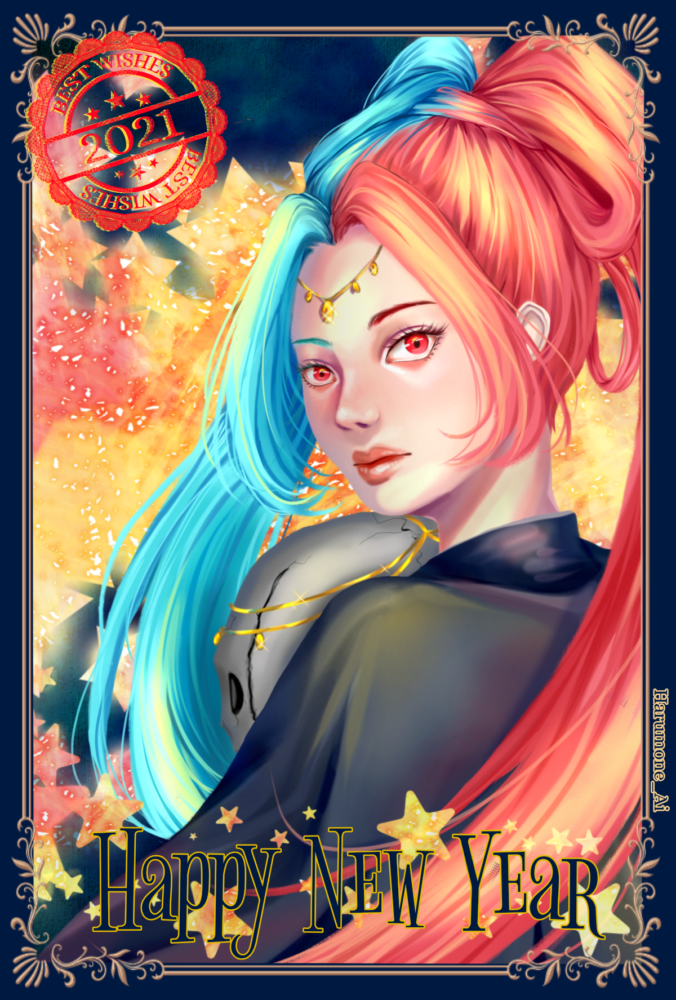
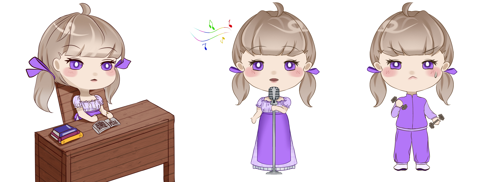
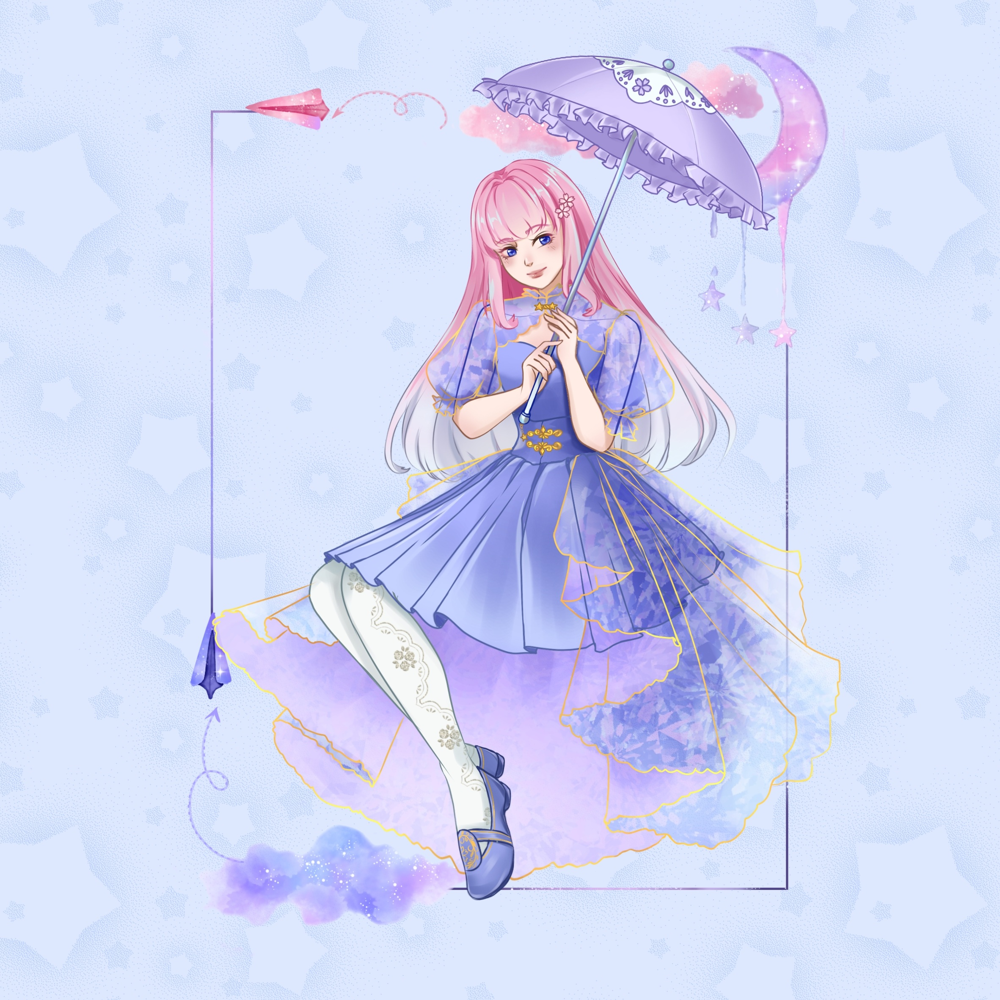

<!--
**harumoneairin/harumoneairin** is a ✨ _special_ ✨ repository because its `README.md` (this file) appears on your GitHub profile.

Here are some ideas to get you started:

- 🔭 I’m currently working on ...
- 🌱 I’m currently learning ...
- 👯 I’m looking to collaborate on ...
- 🤔 I’m looking for help with ...
- 💬 Ask me about ...
- 📫 How to reach me: ...
- 😄 Pronouns: ...
- ⚡ Fun fact: ...
-->

  <!-- TOP HEADER / OC IMAGE -->
  

  <h1>Hi, I'm Harumone 👋</h1>
  
<i>Developer • Digital Artist • Cybersecurity Enthusiast</i>

  <!-- QUICK BADGES / TECH STACK -->
  

    
    
    
    
    
  

---

### 🚀 About Me
* 📱 **Focus:** Mobile Application Development & UI Design.
* 🎨 **Creativity:** Original character design, digital illustration, and visual assets.
* 🛠️ **Current Setup:** Building apps with **Flutter**, **Dart**, **sqflite**, and **Firebase**.
* 🛡️ **Cybersecurity:** Blue Team operations, traffic analysis & digital forensics.
* 🌱 **Currently Learning:** Web development fundamentals (**HTML5**, **CSS3**, **JavaScript**).

  
<b>🔍 View Digital Forensics & Security Toolkit</b>

   

  * 🧠 **Memory Forensics:** LiME (Linux Memory Extractor), Volatility
  * 💾 **Disk & Artifact Analysis:** Autopsy
  * 🌐 **Network Analysis:** Wireshark, tcpdump
  * 🧩 **Data Decoding & Triage:** CyberChef, Hex/Base64 decoders

---

### 🎨 Creative Showcase

  
<b>Click to expand artwork</b>

   
  
Here is a glimpse of my character art and illustrations!

  

    
    
    
  

---

### 📊 GitHub Activity

  

---

  
  <!-- ALIAS SOCIAL LINKS -->
  

